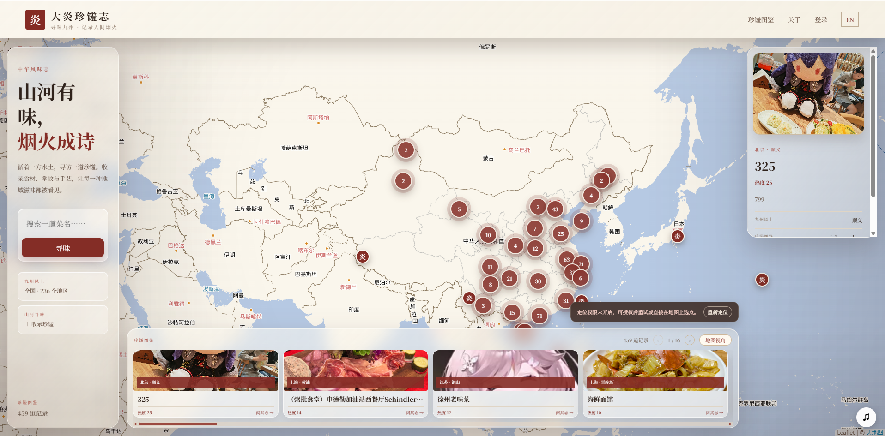
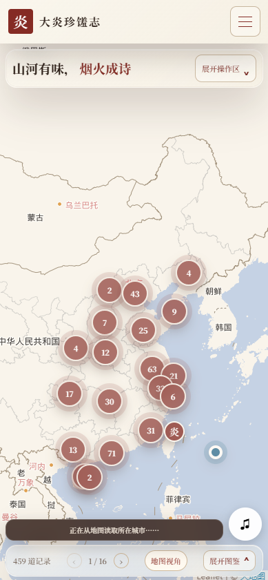

<p align="center">
  <a href="README.md" lang="zh-CN">简体中文</a> | <strong>English</strong>
</p>

<p align="center">
  <a href="https://162.251.94.27/">
    
  </a>
</p>

<h1 align="center">Terra Food · 大炎珍馐志</h1>

<p align="center">
  One map. A hometown dish. A community with stories to share.<br>
  <strong>Discover local flavors. Keep their stories alive.</strong>
</p>

<p align="center">
  <a href="https://162.251.94.27/"></a>
  <a href="https://github.com/Melonmelon-GG/Terra_Food/actions/workflows/ci.yml"></a>
  <a href="LICENSE"></a>
</p>

<p align="center">
  <a href="https://162.251.94.27/">Visit the site ↗</a> ·
  <a href="#preview">Preview</a> ·
  <a href="#features">Features</a> ·
  <a href="#journey">Getting started</a> ·
  <a href="#development">For developers</a>
</p>

---

Terra Food is a map-based food community for Arknights fans and anyone curious about regional cuisine. Inspired by the idea of a Yan food chronicle, it brings real-world flavors into a shared collection: **follow the map, discover the story behind a dish, and add your own.**

**Live site: [https://162.251.94.27/](https://162.251.94.27/)** · Browse as a guest; sign in to contribute dishes, like, and comment.

<a id="preview"></a>

## A glimpse of the food chronicle

<table>
  <tr>
    <th width="81%">Desktop · Explore the food map</th>
    <th width="19%">Mobile · Explore on the go</th>
  </tr>
  <tr>
    <td width="81%" valign="top">
      <a href="docs/assets/website-home.png"></a>
    </td>
    <td width="19%" valign="top">
      <a href="docs/assets/website-mobile.png"></a>
    </td>
  </tr>
</table>

<p align="center"><sub>Desktop and mobile screenshots using the Chinese interface. Click either image to view the original. Community content changes over time.</sub></p>

<a id="features"></a>

## Six ways to explore local flavors

<table>
  <tr>
    <td width="50%" valign="top">
      <h3>🗺️ Follow the flavor</h3>
      <p><strong>Find a taste of home, one place at a time.</strong></p>
      <p>Explore linked map markers and catalog entries, filter by province or city, and search by dish name. Allow location access or pick a spot manually to begin a new entry.</p>
      <p><sub>Region filters · Dish search · Map location · Mobile layouts</sub></p>
    </td>
    <td width="50%" valign="top">
      <h3>📖 Write a food story</h3>
      <p><strong>Save more than a photo. Preserve a little history.</strong></p>
      <p>Add a cover image, ingredients, a story, and a location. Keep a text draft, complete your entries from your profile, and track their review status.</p>
      <p><sub>Image uploads · Dish profiles · Text drafts · Content review</sub></p>
    </td>
  </tr>
  <tr>
    <td width="50%" valign="top">
      <h3>💬 Share a taste</h3>
      <p><strong>Meet the people behind the recommendations.</strong></p>
      <p>Like dishes, exchange tips and stories in the comments, and visit contributors' public profiles. Avatars, display names, and signatures give each contribution a personal touch.</p>
      <p><sub>Comments · Likes · Public profiles · Personal details</sub></p>
    </td>
    <td width="50%" valign="top">
      <h3>⬡ Make your mark</h3>
      <p><strong>Give your food journey a signature of its own.</strong></p>
      <p>Revisit recently viewed dishes and unlock your first-login achievement. Paint a hexagonal grid by clicking or dragging to create, save, and display a custom etched medal.</p>
      <p><sub>Browsing history · Achievements · Medal editor · Profile showcase</sub></p>
    </td>
  </tr>
  <tr>
    <td width="50%" valign="top">
      <h3>✦ Chat with Yu <sub>Optional AI</sub></h3>
      <p><strong>Not sure what to explore next? Ask Yu.</strong></p>
      <p>Get dish suggestions based on region, popularity, and browsing history. Draft a comment or switch the site's music. With the Agent enabled, vector memory can help carry conversations forward.</p>
      <p><sub>Recommendations · Comment drafts · Music switching · Memory</sub></p>
    </td>
    <td width="50%" valign="top">
      <h3>♫ Browse to a familiar tune</h3>
      <p><strong>A little music for your next discovery.</strong></p>
      <p>Browse with playlists, shuffle, seeking, and volume controls. Collapse the player when you need more space. The main interface supports Chinese and English.</p>
      <p><sub>Background music · Playback controls · Compact player · Two languages</sub></p>
    </td>
  </tr>
</table>

### A shared collection needs caretakers, too

Administrators and sub-administrators can maintain community content through the management dashboard:

| Review and maintain | Import in bulk | Share responsibilities |
| --- | --- | --- |
| Review dishes and profile content such as display names, signatures, and medals | Import `.xlsx` / `.xls` files with irregular headers and region information | Administrators can grant or revoke sub-administrator roles |
| Inspect content totals and manage dishes and user status | See duplicate, skipped, and problematic rows for follow-up | Sub-administrators help with day-to-day content management |

<details>
<summary><strong>A few notes on accounts, reviews, and feature boundaries</strong></summary>

- Guests can browse the map, dishes, and public profiles. Contributing, commenting, liking, and accessing a personal profile require sign-in. Registration includes a human-verification challenge and email verification; passwords can be reset using an emailed code.
- New dishes and subsequent edits from regular users require review. Administrator and sub-administrator submissions can be approved directly.
- Cover images are optional. JPG, PNG, and WebP are supported, with a default limit of 5 MB. Text drafts can persist, but image files must be selected again after a page refresh.
- A signed-in user's first visit to a dish each day increases its popularity score; repeated visits that day do not. Browsing history means “viewed,” not physically visited or tasted.
- Achievements currently include a first-login reward, not a full leveling or event system. Custom medals can be saved, edited, deleted, and selected for display.
- AI recommendations are for reference. Comments are drafted first and published only after the user confirms. Java sessions determine user identity; model API keys are not exposed to the browser.
- AI features need additional services and model configuration. The core website works without the Agent. Try asking “Recommend some dishes from Chengdu” or “Suggest something based on my recent browsing.”
- Automatic location requires permission; manual selection remains available. Music may require a page interaction or a click on the play button before it starts.

</details>

<a id="journey"></a>

## Your first visit

| 01 · Explore | 02 · Read | 03 · Connect | 04 · Contribute |
| --- | --- | --- | --- |
| Pick a city and find a dish that interests you | Read its ingredients and story; meet its contributor | Sign in, like or comment, and receive your first medal | Mark a hometown dish and submit its story |

**Before you go:** create a medal on your profile, or ask Yu for another recommendation in an AI-enabled environment.

<p align="center"><a href="https://162.251.94.27/"><strong>Open the food map →</strong></a></p>

---

## Behind the chronicle · Technology

| Module | Main technologies | Responsibilities |
| --- | --- | --- |
| Web frontend | Vue 3, TypeScript, Vite, Leaflet, vue-i18n | Map, catalog, profiles, dashboard, music, and chat interface |
| Business backend | Java 21, Spring Boot, Spring Security, MyBatis | Authentication, permissions, dishes, interactions, reviews, and Agent gateway |
| Data and sessions | MySQL, Flyway, Redis | Business records, database migrations, caching, and login sessions |
| Optional Agent | Python, FastAPI, LangChain, MCP, Milvus, FastEmbed | Model conversations, business tools, and conversation memory |
| Development checks | GitHub Actions | Backend tests, frontend type-checking and builds, Python syntax/import checks, and Compose validation |

<details>
<summary><strong>Explore the repository layout</strong></summary>

```text
Terra_Food/
├── web/                    # Vue website and static assets
├── dayanfood-backend/       # Java business backend
│   └── src/main/resources/db/migration/  # Flyway migrations and seed data
├── agent-service/          # Optional AI API and MCP service
├── .github/workflows/      # CI workflows
├── docker-compose.yml      # Local dependencies and optional Agent containers
└── .env.agent.example      # Compose configuration template
```

</details>

Project code is released under the [MIT License](LICENSE). Check the sources and permissions for music, images, and other third-party assets separately; the code license alone does not grant unrestricted rights to redistribute those assets. See the [background music guide](web/public/audio/README.md) for playlist maintenance (in Chinese).

---

<a id="development"></a>

## Build the next chapter · Developer setup

The sections above show what the site offers. Here is how to run it. **Choose the setup that fits your work; you do not need every service on day one.**

### Choose a setup

| Setup | Best for | What runs on your machine |
| --- | --- | --- |
| A: Core website | Working on dishes, maps, accounts, or the dashboard | MySQL + Redis + Java backend + Vue frontend |
| B: Frontend only | UI work with a shared development backend | Vue frontend, proxied to the agreed development backend |
| C: Full AI integration | Working on Yu, tools, or conversation memory | Setup A plus Agent and vector-storage containers |

**The current Compose file does not run the Java backend or Vue frontend.** Even with `docker compose --profile agent up`, start those two applications separately. This is not a one-command production deployment.

Commands below use **Windows PowerShell**. On macOS / Linux, use the same Git, Docker, Maven, and npm commands; replace `Copy-Item` with `cp` and `$env:NAME = "value"` with `export NAME="value"`. Follow the working-directory notes. Replace all angle-bracket placeholders before running commands.

<details>
<summary><strong>Setup A · Core website | MySQL + Redis + Java + Vue</strong></summary>

### A. Core website development

Prepare JDK 21, Maven 3.9, Node.js 22 (matching CI), and Docker Compose v2. If MySQL and Redis already run locally, skip container startup and configure your existing connections instead.

**1. Get the code and configure local dependencies**

```powershell
git clone https://github.com/Melonmelon-GG/Terra_Food.git
cd Terra_Food
Copy-Item .env.agent.example .env
```

Do not overwrite an existing `.env`. Edit the root `.env` and set `MYSQL_ROOT_PASSWORD` to your own local development password.

The core setup does not call a model. However, some Agent variables use required-value interpolation in Compose and may be checked while parsing the configuration. Keep the template fields nonempty; only setup C requires real Agent, MinIO, and model credentials. Never use template placeholders in an actual deployment.

```powershell
docker compose up -d mysql redis
docker compose ps
```

Wait for MySQL and Redis to become ready. Compose creates the `dayan_food` database; Flyway creates the tables and inserts initial regions and example dishes when the backend starts for the first time.

If you use an existing MySQL instance, create the database yourself and make sure Redis is running:

```sql
CREATE DATABASE dayan_food
    CHARACTER SET utf8mb4
    COLLATE utf8mb4_unicode_ci;
```

**2. Start the Java backend (new terminal, starting at the repository root)**

```powershell
$env:DB_USERNAME = "root"
$env:DB_PASSWORD = "<same value as MYSQL_ROOT_PASSWORD in the root .env>"
$env:REDIS_HOST = "localhost"
$env:REDIS_PORT = "6379"
$env:SESSION_COOKIE_SECURE = "false"

# Optionally create a local administrator without completing email registration.
$env:INITIAL_ADMIN_ENABLED = "true"
$env:INITIAL_ADMIN_PASSWORD = "<your own strong administrator password>"

cd dayanfood-backend
mvn spring-boot:run
```

The backend defaults to `http://localhost:8080`. Select the administrator role on the login page, use username `admin`, and enter the password above. An existing account with that username is neither recreated nor given a new password by this configuration.

After the initial account is created, set `INITIAL_ADMIN_ENABLED` to `false` and remove `INITIAL_ADMIN_PASSWORD` before the next startup. This account lets you explore the local dashboard; testing regular-user registration and review workflows still requires a regular account.

> Compose reads the root `.env`; **it does not automatically become the environment for `mvn spring-boot:run`**. Set Java variables in the same terminal that starts Java, or in your IDE's run configuration. Configure them again when opening a new terminal.

**3. Start the Vue frontend (another terminal, starting at the repository root)**

```powershell
cd web
npm ci
npm run dev
```

Visit `http://localhost:5173`, or the address Vite prints if that port is occupied. Vite proxies `/api` and `/uploads` to `http://localhost:8080` by default. Prefer this same-origin proxy during development.

Optional map configuration: add `VITE_TIANDITU_KEY=your-browser-side-tianditu-key` to `web/.env.local`, then restart Vite. Without it, fallback paths such as OpenStreetMap are available, but map tiles and reverse geocoding still need external network access. Never put server-side secrets into any `VITE_*` variable.

**4. Configure email to test registration or password reset**

Set these variables in the terminal or IDE that starts Java, then restart the backend:

```powershell
$env:MAIL_HOST = "<SMTP server>"
$env:MAIL_PORT = "587"
$env:MAIL_USERNAME = "<SMTP username>"
$env:MAIL_PASSWORD = "<SMTP password or app password>"
$env:MAIL_FROM = "<sender email address>"
$env:MAIL_SMTP_AUTH = "true"
$env:MAIL_STARTTLS_ENABLED = "true"
$env:MAIL_SSL_ENABLED = "false"
```

This example uses STARTTLS on port 587. Match the port and encryption settings to your mail provider. Without a mail service, verification-code delivery failures do not mean the entire website is unavailable. Do not disable verification just to make integration testing pass.

</details>

<details>
<summary><strong>Setup B · Frontend only | Use a shared development backend</strong></summary>

### B. Frontend-only development

Use this when a teammate provides a dedicated development backend. You do not need local MySQL, Redis, or Java.

Set the following in `web/.env.local`:

```dotenv
# Replace with the team's development backend, reachable from your machine.
VITE_BACKEND_TARGET=http://127.0.0.1:8080
```

Run `npm ci` and `npm run dev` in `web`. This setting proxies both API requests and uploaded images. Restart Vite after changing it.

Use a **dedicated development environment and test accounts**. Do not point upload, review, or deletion tests at production by default. If login fails, check the development backend's cookies, CORS, and proxy configuration together. Local HTTP and production HTTPS should not share identical cookie-security settings.

</details>

<details>
<summary><strong>Setup C · Full AI integration | Add Yu to the core website</strong></summary>

### C. Full AI integration

Complete setup A first. Running the Agent in Docker does not require Python on the host. For direct Python development or validation, use Python 3.12 to match the containers and CI.

**1. Fill in real configuration in the root `.env`**

| Variable | Purpose |
| --- | --- |
| `MYSQL_ROOT_PASSWORD` | Keep it consistent with the existing local MySQL password; do not change it arbitrarily |
| `AGENT_INTERNAL_TOKEN` | Generate a strong random internal token, preferably at least 32 characters; Java and Agent values must match |
| `MINIO_ROOT_USER` / `MINIO_ROOT_PASSWORD` | Credentials for the local vector-storage dependency; replace the placeholders |
| `OPENAI_API_KEY` | API key for your chosen OpenAI-compatible model service |
| `OPENAI_BASE_URL` | Endpoint matching that key; configure it for non-default providers |
| `AGENT_MODEL` | A model ID actually supported by that endpoint; the template value is not universal |
| `EMBEDDING_MODEL` | Defaults to `BAAI/bge-small-zh-v1.5`; the first use may download model files |
| `AGENT_PERSONA` | Optional; leave blank to use the built-in Yu persona, or set it to override the persona |

**2. Start the containers from the repository root**

```powershell
docker compose --profile agent up -d --build
docker compose --profile agent ps
```

Alongside MySQL and Redis, this starts Agent API, MCP, Milvus, etcd, and MinIO. Initial image pulls, Python dependency builds, and embedding-model downloads can take time. A running container does not necessarily mean all its dependencies are ready.

**3. Configure the Agent connection for Java and restart it**

Keep the database and other environment variables from setup A, then add:

```powershell
$env:AGENT_INTERNAL_TOKEN = "<exactly the same internal token as in the root .env>"
$env:AGENT_SERVICE_URL = "http://127.0.0.1:8090"
```

Restart the Java backend. Start the frontend normally, sign in, and open the chat entry for Yu.

MCP calls the host's Java backend at `http://host.docker.internal:8080` by default. If your backend runs elsewhere, override `BACKEND_INTERNAL_URL` in the root `.env` and update the relevant container.

```powershell
# Run from the repository root. Review and redact logs before sharing them.
docker compose --profile agent logs --tail=100 agent-api agent-mcp milvus
Invoke-RestMethod http://127.0.0.1:8090/health
```

`/health` only confirms that Agent API responds; it does not validate the model key, MCP tools, or vector memory. Complete a conversation on the website as well. After editing Agent source code, rerun the startup command with `--build`; the current Compose setup does not mount source files for hot reload.

</details>

<details>
<summary><strong>Having trouble? Configuration and troubleshooting checklist</strong></summary>

### Configuration and troubleshooting

See [application.yml](dayanfood-backend/src/main/resources/application.yml) for backend settings and [agent-service/README.md](agent-service/README.md) for the additional Agent notes (in Chinese).

| Symptom | Check first |
| --- | --- |
| Java cannot connect to MySQL | MySQL readiness and `DB_PASSWORD`; use `DB_URL` and `DB_USERNAME` for non-default connections |
| Login or verification-code errors | Redis connectivity, `REDIS_PASSWORD` if required, and complete mail configuration |
| Still signed out after login | Whether requests use the Vite proxy, and whether local HTTP incorrectly uses `SESSION_COOKIE_SECURE=true` |
| Port conflict | Defaults are 3306, 6379, 8080, and 5173; the full AI setup also exposes host port 8090. Update connection settings when changing mappings |
| A submitted dish is missing from the map | Regular-user submissions need approval; check its review status on your profile |
| Uploaded images do not display | The `/uploads` proxy, readable backend `UPLOAD_DIRECTORY`, and whether the files still exist |
| Blank map or failed address lookup | Network access to map providers and the Tianditu key; automatic location needs permission and a secure context (HTTPS or localhost) |
| Cannot connect to Yu | Matching Java/Agent tokens, model endpoint, model ID, API key, and container logs |
| Compose reports missing variables | Root `.env` exists and required fields are nonempty; never commit real credentials |
| MySQL authentication fails after editing `.env` | Initialization variables do not change the password in an existing data volume. Check the original password instead of deleting the volume |

To stop local dependencies while retaining containers and data, run `docker compose --profile agent stop` from the repository root. Do not use `docker compose down -v` as a routine restart command: it removes named volumes.

The current Compose setup targets local development. MySQL and Redis port mappings are not restricted to loopback, so do not deploy this configuration unchanged on a public server. Plan HTTPS, reverse proxying, database network isolation, restricted accounts, secret management, and backups of both the database and uploaded files separately. The production `prod` profile enables Secure cookies by default.

</details>

<details>
<summary><strong>Ready for a PR? Validation commands and collaboration notes</strong></summary>

### Before submitting a change

Run these commands in the indicated directories:

```powershell
# Repository root → Java backend
cd dayanfood-backend
mvn --batch-mode --no-transfer-progress verify

# Java backend directory → Vue frontend
cd ../web
npm ci
npm run build
```

For Agent changes, use a Python 3.12 virtual environment with `agent-service/requirements.txt` installed. Start at the repository root:

```powershell
python -m compileall -q agent-service/app
cd agent-service
python -c "import app.main; import app.mcp_server"
```

For Compose changes, run `docker compose --profile agent config --quiet` from the repository root, with all required variables set to nonempty values.

The current [CI workflow](.github/workflows/ci.yml) runs on pushes to `main`, PRs targeting `main`, and manual dispatch. It checks backend tests, frontend types and builds, Python syntax and imports, and Compose configuration. **It does not replace browser E2E tests, real-database integration tests, full Agent conversation tests, or automatic deployment.** Manually verify the relevant page and API workflows as well.

- Create a working branch from the latest main branch, such as `feat/food-search`, `fix/map-location`, or `docs/readme`, and submit a PR when ready.
- Describe the purpose and verification steps in the PR. Include desktop and mobile screenshots for UI changes and document any new configuration variables.
- Change database structure through a new Flyway migration; do not rewrite migrations already applied in shared environments.
- Update both frontend language files when adding user-facing text.
- Keep `README.md` (Chinese) and `README.en.md` (English) in sync when changing features, configuration, or startup commands.
- Never commit `.env`, `.env.local`, model keys, mail app passwords, database passwords, or real user data.

</details>

---

<p align="center">
  <strong>Remember the flavors, and the people and moments behind them.</strong><br>
  <sub>Terra Food · 大炎珍馐志</sub>
</p>

<p align="center"><a href="README.md" lang="zh-CN">简体中文</a> | <strong>English</strong></p>
